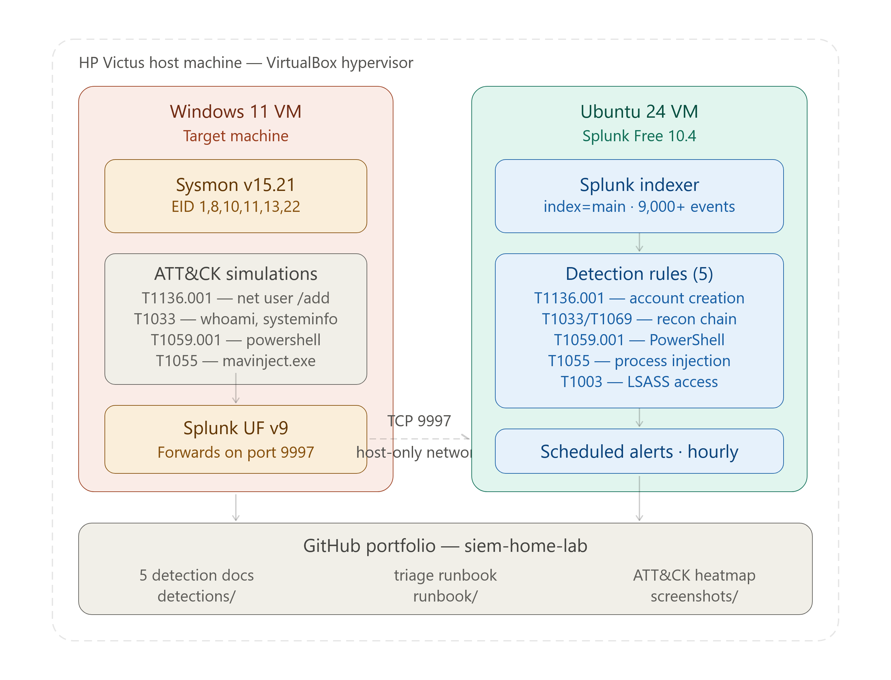

## Detection Coverage

| # | Technique | MITRE ID | Severity | Sysmon EID | Status |
|---|---|---|---|---|---|
| 1 | Local Account Creation | T1136.001 | High | EID 1 | ✅ Live |
| 2 | Recon Command Chain | T1033/T1069 | Medium | EID 1 | ✅ Live |
| 3 | Suspicious PowerShell | T1059.001 | High | EID 1 | ✅ Live |
| 4 | Process Injection | T1055 | High | EID 8 | ✅ Live |
| 5 | LSASS Credential Access | T1003 | Critical | EID 10 | ✅ Live |
## Architecture

**Host:** HP Victus — VirtualBox hypervisor  
**Target VM:** Windows 11 — Sysmon v15.21 + Splunk Universal Forwarder  
**SIEM VM:** Ubuntu 24 — Splunk Free 10.4  
**Transport:** Sysmon logs → UF → TCP 9997 → Splunk indexer  
**Index:** main · 9,000+ events collected
